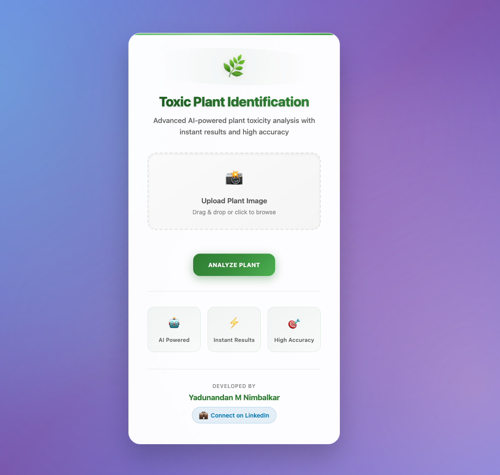

# AI-Powered Toxic Plant Identification

This project leverages the power of artificial intelligence to classify plants as **toxic** or **non-toxic** using image recognition. The system is designed to assist individuals in identifying harmful plants, helping to safeguard communities by preventing potential risks associated with toxic plant exposure.

---

## Features

- **Image Classification:** Determines whether a plant is toxic or non-toxic based on uploaded images.
- **Web Interface:** User-friendly interface to upload plant images and view results.
- **Deep Learning:** A Convolutional Neural Network (CNN) trained for high accuracy in plant classification.
- **Scalable Backend:** Flask-based API for efficient image processing and prediction.

---

## Project Structure

```
AI-Powered-Toxic-Plant-Identification/
├── app.py                 # Flask application file
├── static/                # Static files (CSS, JS, Images)
├── templates/             # HTML templates for the web interface
├── data_preprocessing.ipynb  # Notebook for data preprocessing
├── model_training.ipynb      # Notebook for training the model
├── classification.ipynb      # Notebook for testing the model
├── toxic_plant_classifier.h5  # Trained model
├── requirements.txt       # Python dependencies
├── README.md              # Project documentation
```

---

## Installation

### Prerequisites

- Python 3.8 or higher
- Pip (Python package manager)
- Flask
- TensorFlow
- OpenCV
- NumPy

### Steps

1. **Clone the repository:**
   ```bash
   git clone https://github.com/your_username/AI-Powered-Toxic-Plant-Identification.git
   cd AI-Powered-Toxic-Plant-Identification
   ```

2. **Install dependencies:**
   ```bash
   pip install -r requirements.txt
   ```

3. **Prepare the dataset:**
   - Ensure your dataset is available in CSV format with columns `path` (image path) and `toxicity` (0 for non-toxic, 1 for toxic).
   - Update the `data_preprocessing.ipynb` notebook with the correct image paths and run it to preprocess the data.

4. **Train the model:**
   - Open `model_training.ipynb` and execute the cells to train the CNN model.
   - Save the trained model as `toxic_plant_classifier.h5`.

5. **Run the application:**
   ```bash
   python app.py --port=5000
   ```

6. **Access the web interface:**
   - Open your browser and navigate to `http://127.0.0.1:5000`.

---

## Usage

1. Launch the application by running `app.py`.
2. Upload a plant image using the web interface.
3. View the classification result (Toxic/Non-Toxic).

---

## How It Works

### Data Preprocessing
- Images are resized to 128x128 pixels and normalized.
- The dataset is split into training and testing sets.

### Model Training
- A Convolutional Neural Network (CNN) is built using TensorFlow and Keras.
- The model is trained on the preprocessed dataset with binary classification output.

### Web Interface
- Built using Flask and HTML/CSS.
- Users can upload plant images, which are passed to the trained model for classification.
## 📷 Demo

Upload an image of a plant and get a prediction on whether it's toxic.

| Upload Page | Result Page |
|-------------|-------------|
|  |  |
---

## Technologies Used

- **Programming Languages:** Python, HTML, CSS, JavaScript
- **Frameworks:** Flask (for the backend)
- **Libraries:** TensorFlow, OpenCV, NumPy, Matplotlib


## Future Enhancements

- Add support for additional plant species.
- Improve model accuracy with a larger dataset.
- Integrate additional features like toxicity descriptions and safety precautions.

---

## Contributing

Contributions are welcome! Please follow these steps:

1. Fork the repository.
2. Create a feature branch: `git checkout -b feature-name`
3. Commit your changes: `git commit -m 'Add feature'`
4. Push to the branch: `git push origin feature-name`
5. Open a pull request.

---

## License

This project is licensed under the MIT License. See the `LICENSE` file for details.

---

## Acknowledgments

- TensorFlow and Keras for machine learning tools.
- Flask for the web framework.
- OpenCV for image processing.
- Images for training from kaggle : https://www.kaggle.com/datasets/hanselliott/toxic-plant-classification?resource=download

---


